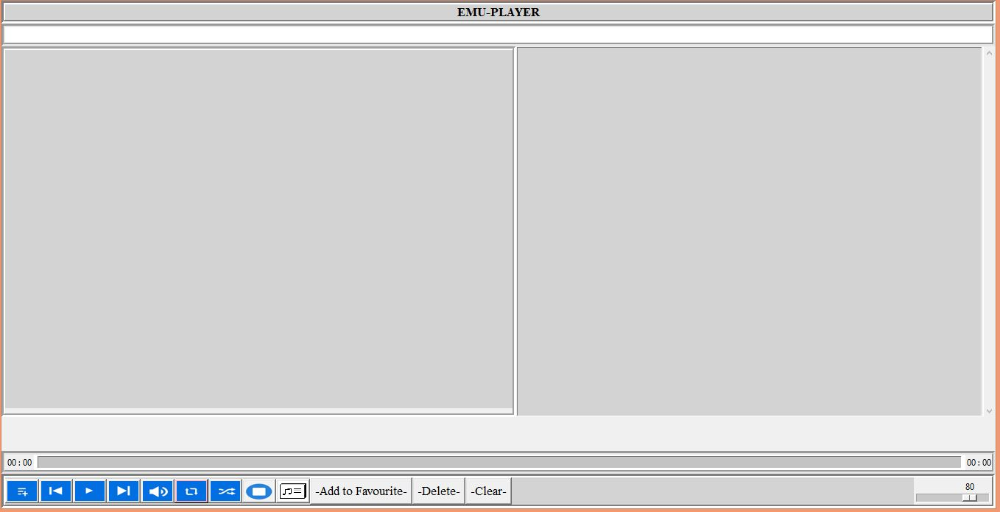
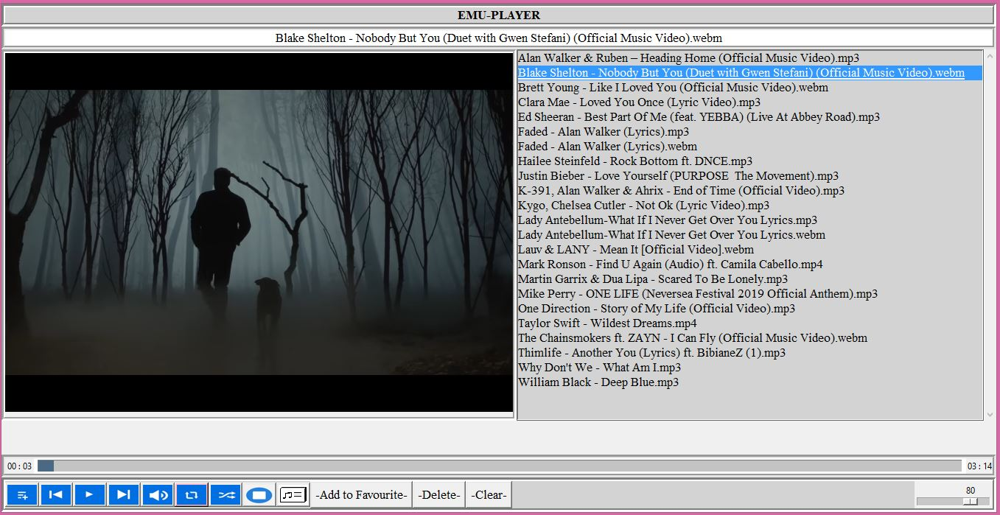

PLAYER
======

Player is a project that lets you play your favorite videos and audios conveniently.
It supports all major video and audio file extensions such as mp4, mp3, wav, vob etc. The player 
automatically loads all audio and video files in  a directory, sparing you the hectic of manually
adding a single file at a time. The player also accommodates all play modes, repeat, shuffle and descending
mode. The player presents you with an easy-to-use interface and buttons that performs all player 
functionalities as shown below.


How to use the player
--------------------
First you will need to fork the repository and clone it to have a local copy of 
the project in your desktop. Then install the following third party modules:
```
pip install pygame
pip install vlc
pip install mutagen
pip install pillow
```
You also need to make sure vlc is installed in your system the 64-bit version then feel free
to execute the `main.py` file to load the player. Click on the first button on your
left with a plus sign to load your directory files. Your directory video and audio files
will be automatically loaded into the player and neatly appear on the player as shown the 
figure below.

Now you are all set double click on a file to play and enjoy. Explore the rest of the player 
and open issues if any, would also appreciate a star on the repository.

Author
------
Erastus Nzula, 2021


